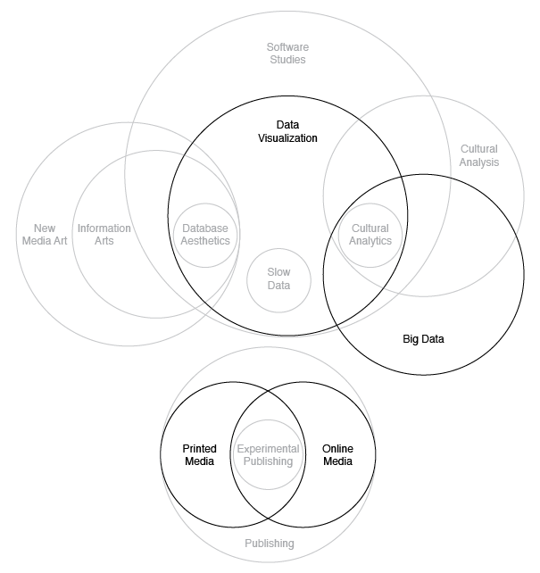

# Domain Diagram and Analysis

Gabriel Gianordoli

Thesis Studio 2

Professors Sven Travis and Loretta Wolozin

March 10th, 2014

## Concept Statement

Every second today, companies collect a large amount of records about people's online behaviours. Often referred to as "big data," these records are important in the study of society and culture. Some of this data is publicly available through the platforms themselves — pictures and comments from social media, for example. A considerable smaller part can be accessed through APIs. In both cases though, public access is limited and fragmented. As a consequence, its use is mostly limited to profit for the companies only.

This project uses Google aggregated search data as an exemplary case of this issue. It will build an archive of daily Google Autocomplete predictions, for multiple countries and products — web, Google Images, Youtube, etc. Users can have access to this information both through an online and a printed output. The former will provide an open tool for research, allowing multiple ways to access this data. The latter will serve as a channel to communicate and discuss the findings of the project.

The purpose is to raise awareness on its cultural value and answer questions such as: How can this data be used in cultural studies? What information does it provide compared to other online sources? What are the the current limitations to its access?

## Domain Diagram

The content-area subject of this project is *cultural big data*. It will approach the issue posed by the concept statement using *data visualization*, through both *online* and *printed media*.

### Big Data

The term big data was first introduced in 2001, by analyst Doug Laney. [laney_3-d_2001] Technically, it is defined as "a broad term for data sets so large or complex that traditional data processing applications are inadequate." [@_big_2015]

Laney used the term in the specific context of business intelligence. Since then, the systematic collection of data has spread out to different areas. However, the access to this data has been kept restricted to companies for the most part. French philosopher Pierre Lévy states that "the big data available on the Internet is currently analysed, transformed and exploited by big governments, big scientific laboratories and big corporations." [@_big_]

Lévy argues that social computing and descentralized communication led to the first digital revolution. According to him, a new one will happen with the democratisation of the processing and analysis of big data.

### Data Visualization

This project defines *data visualization* as the process of giving visual form to data. The concept should not be mistaken by the final visual piece, which is only the last part of a sequence. As data artist Jer Thorp points out "people talk about visualization as a thing(...) A visualization is a noun but it’s a verbal noun, it has a verb built into it. Visualization is a process." [@_ng_]

This idea is also present in the framework described by data visualization expert Ben Fry, which lists seven stages for visualizing data: acquire, parse, filter, mine, represent, refine, and interact. [fry_visualizing_2008]

A broad range of practices can fall into the *data visualization* category though, depending on their purpose and final form. This project borrows methods from at least 3 of them: database aesthetics, slow data, and cultural analytics.

#### Database Aesthetics

*Database aesthetics* here is considered a subset of information arts, on the intersection with data visualization. It defines works of art that apply the logics and aesthetics of databases, often providing "a way of revealing (visual) patterns of knowledge, beliefs, and social behavior." [@paul_database_2007]

*Information arts* is defined by scholars Christiane Paul and Jack Toolin as works that "explore or critically address the issues surrounding the processing and distribution of information by making information itself the medium and carrier of this exploration." [@paul_encyclopedia_]

#### Slow Data

The term *slow data* was first used by business intelligence analyst Stephen Few, as a reference to *slow food*. While the latter was founded by Carlo Petrini in response to the spread of fast-food, Few's suggestion is directed towards the misuse of big data: "I believe that it is time to extend the Slow Movement to the realm of information technology. In this time of so-called big data, too much is being missed in our rush to expand." [@_visual_]

The term was originally used in the context of business intelligence and decision-making. This project will utilize it as a deliberate strategy to engage users in a slow exploration of data.

#### Cultural Analytics

The expression *cultural analytics* was introduced by researcher Lev Manovich to define both the subject and techniques applied by him and his collaborators. It argues for a "systematic use of large-scale computational analysis and interactive visualization of cultural patterns," [@manovich_cultural_2009] utilizing of large digital datasets.

This project shares some of the principles of *cultural analytics*, approaching big data as an important cultural record.

## Writing and Designing Iteration

The definition of the domains helped reframe the concept statement of this project. The previous one had a focus on the technical aspects of the subject — databases. However, the problem with not knowing how they work is just part of a larger issue, that I found out researching the subject area. What do they refer to? Why are they important? Why aren't they accessible?

As a consequence of these new questions, the online and printed outputs now have better defined roles and audiences. I will develop the former as an exploratory tool, with research focus. The latter will be a communication piece, serving as a report of my process and a way to discuss the importance and limits of using big data in cultural studies.